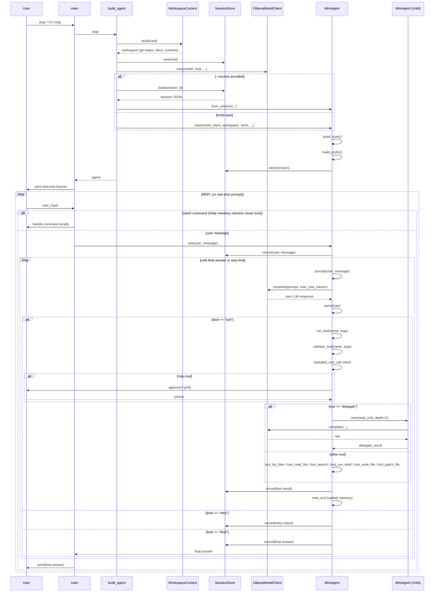

# Mini Coding Agent — Sequence Diagram

```mermaid
sequenceDiagram
    participant User
    participant main
    participant build_agent
    participant WorkspaceContext
    participant SessionStore
    participant OllamaModelClient
    participant MiniAgent
    participant ChildAgent as MiniAgent (child)

    User->>main: argv / CLI args
    main->>build_agent: args
    build_agent->>WorkspaceContext: build(cwd)
    WorkspaceContext-->>build_agent: workspace (git status, docs, commits)
    build_agent->>SessionStore: new(root)
    build_agent->>OllamaModelClient: new(model, host, ...)
    alt --resume provided
        build_agent->>SessionStore: load(session_id)
        SessionStore-->>build_agent: session JSON
        build_agent->>MiniAgent: from_session(...)
    else fresh start
        build_agent->>MiniAgent: new(model_client, workspace, store, ...)
    end
    MiniAgent->>MiniAgent: build_tools()
    MiniAgent->>MiniAgent: build_prefix()
    MiniAgent->>SessionStore: save(session)
    build_agent-->>main: agent

    main->>User: print welcome banner

    loop REPL (or one-shot prompt)
        User->>main: user_input
        alt slash command (/help /memory /session /reset /exit)
            main->>User: handle command locally
        else user message
            main->>MiniAgent: ask(user_message)
            MiniAgent->>SessionStore: record(user message)

            loop until final answer or step limit
                MiniAgent->>MiniAgent: prompt(user_message)
                MiniAgent->>OllamaModelClient: complete(prompt, max_new_tokens)
                OllamaModelClient-->>MiniAgent: raw LLM response

                MiniAgent->>MiniAgent: parse(raw)

                alt kind == "tool"
                    MiniAgent->>MiniAgent: run_tool(name, args)
                    MiniAgent->>MiniAgent: validate_tool(name, args)
                    MiniAgent->>MiniAgent: repeated_tool_call check
                    alt risky tool
                        MiniAgent->>User: approve? [y/N]
                        User-->>MiniAgent: yes/no
                    end
                    alt tool == "delegate"
                        MiniAgent->>ChildAgent: new(read_only, depth+1)
                        ChildAgent->>OllamaModelClient: complete(...)
                        OllamaModelClient-->>ChildAgent: raw
                        ChildAgent-->>MiniAgent: delegate_result
                    else other tool
                        MiniAgent->>MiniAgent: tool_list_files / tool_read_file / tool_search / tool_run_shell / tool_write_file / tool_patch_file
                    end
                    MiniAgent->>SessionStore: record(tool result)
                    MiniAgent->>MiniAgent: note_tool (update memory)
                else kind == "retry"
                    MiniAgent->>SessionStore: record(retry notice)
                else kind == "final"
                    MiniAgent->>SessionStore: record(final answer)
                    MiniAgent-->>main: final answer
                end
            end

            main->>User: print(final answer)
        end
    end
```